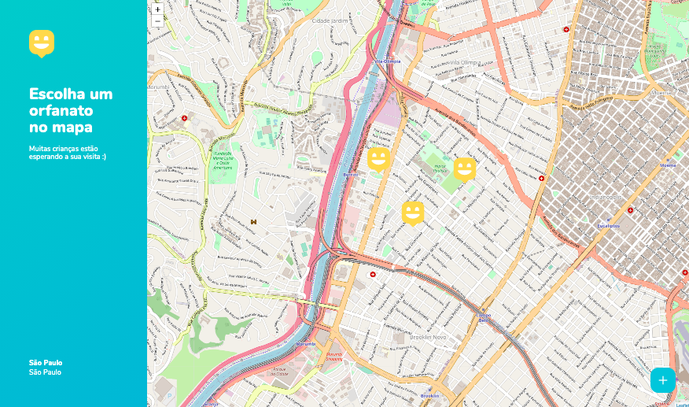
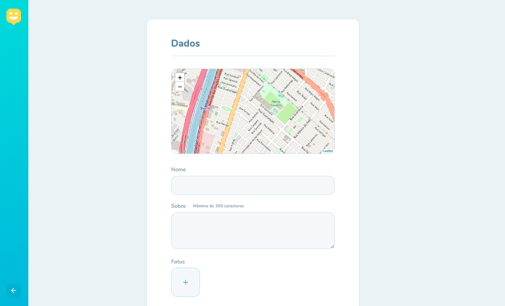
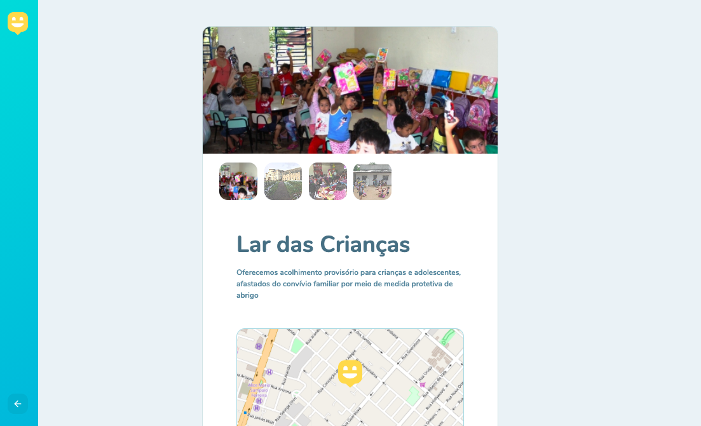

# Happy-NLW-03

<p align="center">
    
</p>

<p align="center">
  <a href="#-projeto">Projeto</a>&nbsp;&nbsp;&nbsp;|&nbsp;&nbsp;&nbsp;
  <a href="#hammer_and_wrench-tecnologias">Tecnologias</a>&nbsp;&nbsp;&nbsp;|&nbsp;&nbsp;&nbsp;
  <a href="#card_index_dividers-utilização">Utilização</a>&nbsp;&nbsp;&nbsp;|&nbsp;&nbsp;&nbsp;
  <a href="#memo-licença">Licença</a>
</p>


<p align="center">
  
</p>
<p align="center">
  
  
  
</p>

## 🚀 Projeto
O **Happy** é um projeto que visa facilitar visitas aos orfanatos próximos a você 💜 

Este é um projeto desenvolvido durante a **[Next Level Week](https://nextlevelweek.com/)**, realizada pela **[@Rocketseat](https://github.com/Rocketseat)** durante os dias 12 a 18 de Outubro de 2020.

O projeto é dividido entre as seguintes partes:


- 📊  **API**
  - Backend da Aplicação. O servidor processa as requisições e retorna os dados em formato JSON.

- 💻  **Web**
  - Frontend. Versão do site para desktop.

- 📱  **Mobile (:construction: Em desenvolvimento :construction:)**
  - Versão do site para dispositivos móveis.


## :hammer_and_wrench: Tecnologias

Esse projeto foi desenvolvido com as seguintes tecnologias:

- [Node.js](https://nodejs.org/en/)
- [TypeScript](https://www.typescriptlang.org/)
- [Express](https://expressjs.com/pt-br/)
- [SQLite](https://www.sqlite.org/index.html)
- [React](https://reactjs.org)
- [React Native](https://facebook.github.io/react-native/)
- [Expo](https://expo.io/)


## :card_index_dividers: Utilização


### 📦	Clonando o App:

```bash
# Clonar o repositório
$ git clone https://github.com/Alessandro1918/Happy-NLW-03
```


### ▶️ Rodando o App:

- 📊  API

```sh
  $ cd backend
  
  # Install dependencies.
  $ yarn # or npm install
  
  # Create tables in the database file
  # (run the "typeorm" script from package.json)
  $ yarn typeorm migration:run # or npm run typeorm migration:run
  
  # Start API (run the "dev" script from package.json):
  $ yarn dev # or npm run dev

  # API endpoints
  $ http://localhost:3333
  $ http://localhost:3333/orphanages
  ```

- 💻   Web app

```sh
  $ cd web
  
  # Install dependencies.
  $ yarn # or npm install
  
  # Running web app
  $ yarn start # or npm start

  # Adress
  $ http://localhost:3000
```

- 📱  Mobile app

```sh
  $ cd mobile
  
  # Install dependencies.
  $ yarn # or npm install
  
  # Running mobile app
  $ yarn start # or npm start
```


## :memo: Licença

Esse projeto está sob a licença MIT. Veja o arquivo [LICENSE](LICENSE.md) para mais detalhes.
